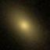
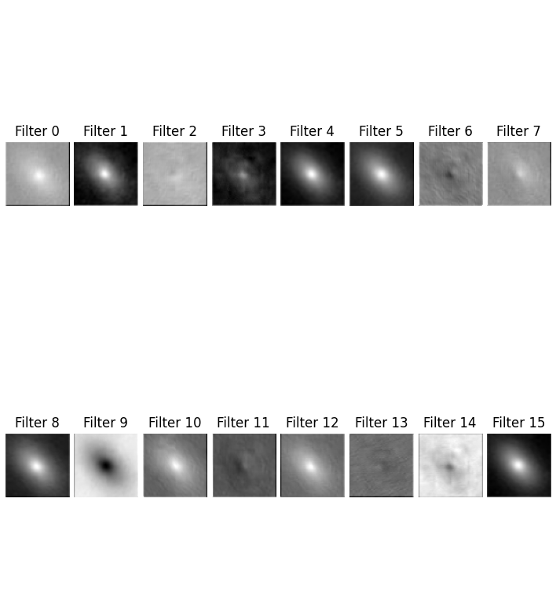
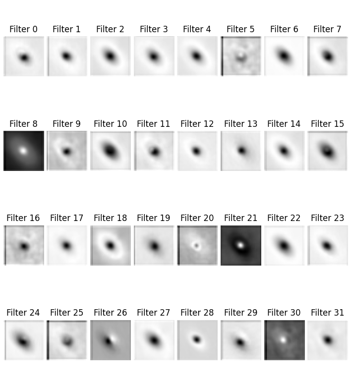
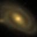
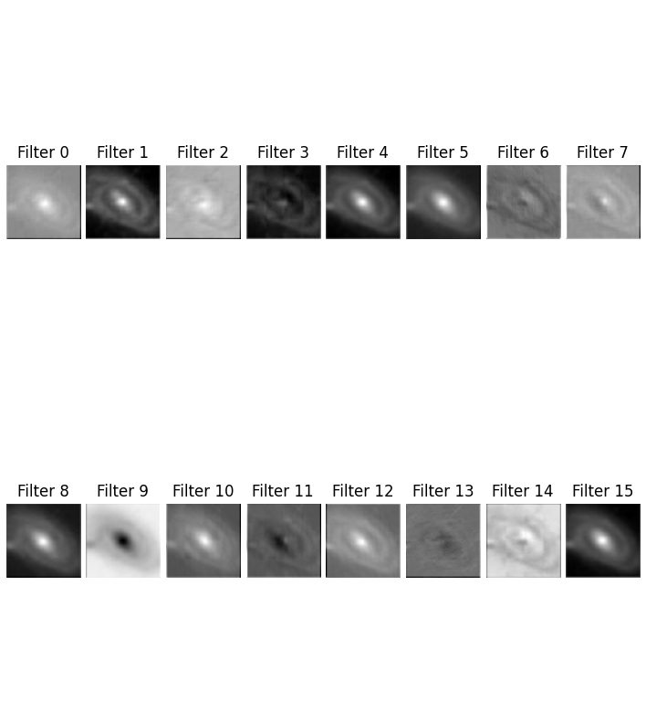
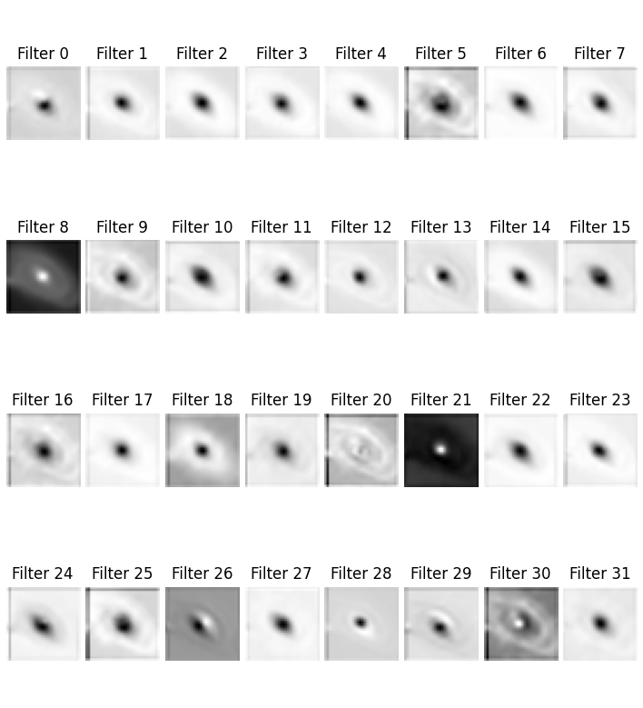

# Galaxy ML Classifier
This project aims to train a machine learning classifier that categorizes images of galaxies into elliptical or spiral morphologies. It does so by using data from the Galaxy Zoo survey to select, and subsequently clean, a subset of SDSS objects. These objects are then requested via the hips2fits api, labeled, and used as training inputs to a convolutional neural network.

